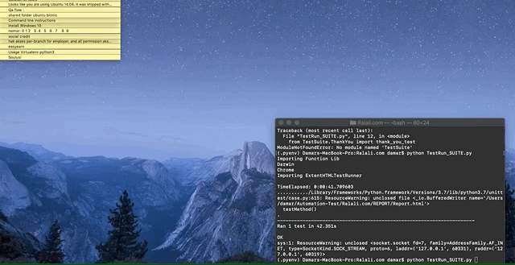
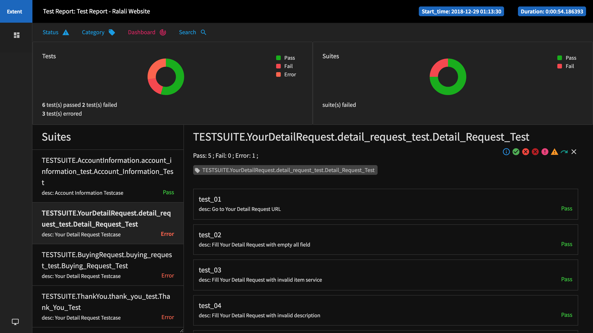
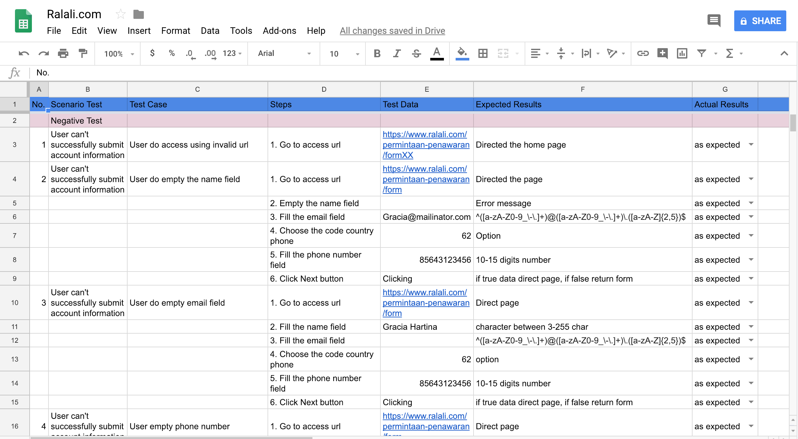

# Automation Test ralali.com web apps

### Requirements
- selenium==3.141.0
- urllib3==1.24.1

### Python
- Python 3.7.1

### OS (already tested)
- macOS Mojave 10.14

### NOTE!!!
- If error on windows try to change the Browser and Browser_Mode on variables.py in PUBLIC_FUNCTION/
- Change Firefox to Chrome and deactivate headless mode (e.g insert "-" character)
- You can see in directory driver/

### How to use

- optional

1. Download and Install git https://git-scm.com/downloads
2. Create folder and then go to the folder
3. Git init
4. Git pull request https://github.com/damarmustikoaji/ralali_RequestForQuotation.git and fill the username-password (when the modal is appear)
4. or git clone https://github.com/damarmustikoaji/ralali_RequestForQuotation.git
5. Install virtual enviroment (optional)

- required

6. Install selenium
7. Or install from requirements.txt : pip install -r requirements.txt
8. Upgrade python to 3.7 or more than that
9. Run script

### How Running all test
- python TestRun_SUITE.file.py

### Report Results
- ExtentHTMLTestRunner is modify from HTMLTestRunner to UI similar ExtentReport, in directory PUBLIC_FUNCTION/
- For Report file in Report/

### PUBLIC_FUNCTION
- is configuration the browser driver
- is public variables for used test (e.g input, browser)

### Browser Driver
- Create directory ../driver for dependency lib, or set path enviroment driver (e.g /usr/local/bin) http://jonathansoma.com/lede/foundations-2017/classes/more-scraping/selenium/
- Download chromedriver https://sites.google.com/a/chromium.org/chromedriver/downloads
- Download geckodriver https://github.com/mozilla/geckodriver/releases
- Can changes in PUBLIC_FUNCTION/variables.py (BROWSER and BROWSER_MODE)
- For function drive can changes in PUBLIC_FUNCTION/FUNC_LIBRARY.py

### GIF

### Report HTML

- File report Report/Report.html

### Testcase

